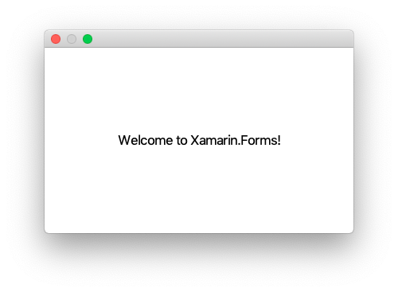

# Xamarin Forms1 for macos

* The solution adds a macos version to iOS/Andriod Xamarin forms cross platform application.


## Steps to make this

1. Create a Xamarin Forms app
1. Add a Cocoa app
1. Add Xamarin.Forms Nuget package into the Cocoa app
1. Add a project reference to xamarinforms1 (.NET standard) project in the Cocoa app
1. Remove Main.storyboard from the Cocoa app
1. Remove NSMainStryboardFile from the Cocoa app -> info.plist -> show source
1. Modify the Cocoa app
   * add ```NSApplication.SharedApplication.Delegate = new AppDelegate();``` in Main.cs
   
   ```csharp
        static void Main(string[] args)
        {
            NSApplication.Init();
            NSApplication.SharedApplication.Delegate = new AppDelegate();
            NSApplication.Main(args);
        }
   ```
   
   * Modify AppDelegate.cs. See the file for the details.
     * Add ```using Xamarin.Forms...```
     * Inherit ```FormsApplicationDelegate```
     * Add ```NSWindow window```
     * Modify ```DidFinishLaunching```

    ```csharp
    using Xamarin.Forms;
    using Xamarin.Forms.Platform.MacOS;

    namespace xamarin.macos
    {
        [Register("AppDelegate")]
        public class AppDelegate : FormsApplicationDelegate
        {
            NSWindow window;

            public override NSWindow MainWindow
            {
                get
                {
                    return window;
                }
            }

            public AppDelegate()
            {
                var style = NSWindowStyle.Closable | NSWindowStyle.Resizable | NSWindowStyle.Titled;
                var rect = new CoreGraphics.CGRect(100, 100, 1024, 768);
                window = new NSWindow(rect, style, NSBackingStore.Buffered, false);
                window.Title = "Hoge";
                window.TitleVisibility = NSWindowTitleVisibility.Hidden;
            }

            public override void DidFinishLaunching(NSNotification notification)
            {
                Forms.Init();
                LoadApplication(new xamarinforms1.App());
                base.DidFinishLaunching(notification);
            }
    ...
    ```

1. Build and run. You'll get the welcome window.

    
